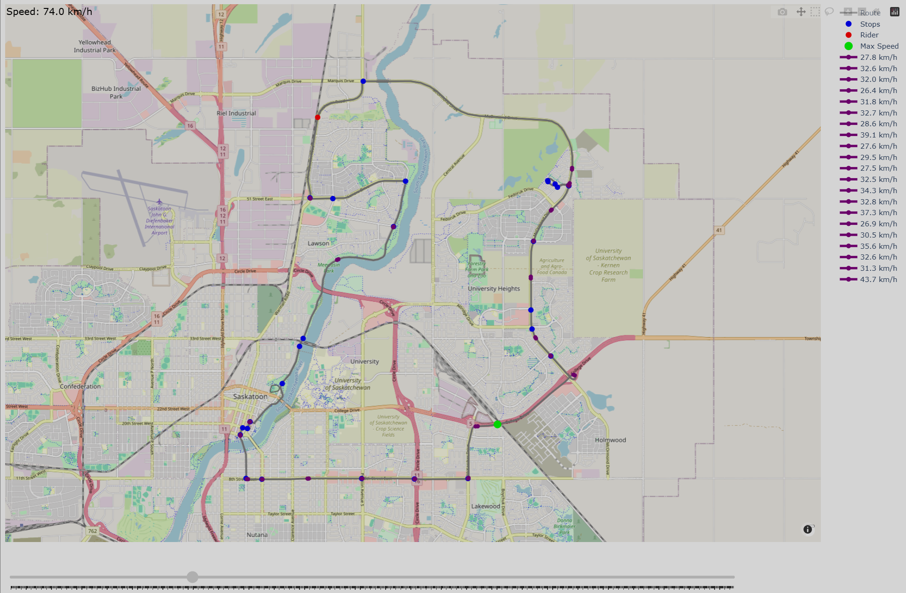
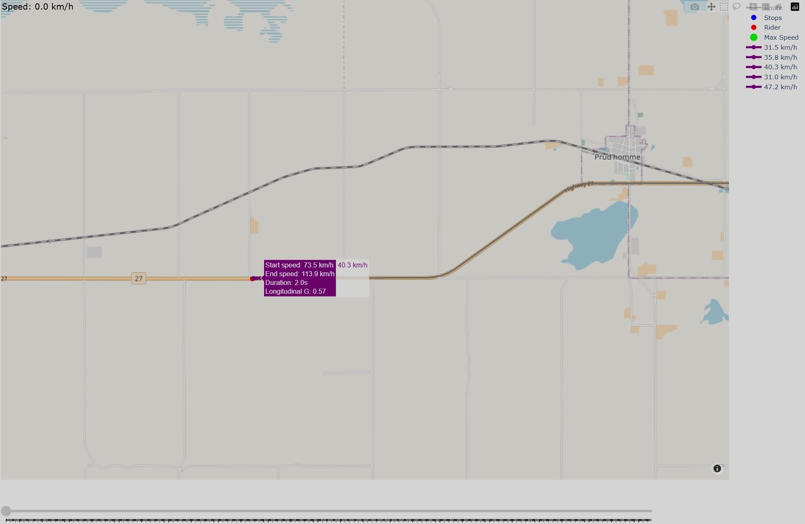
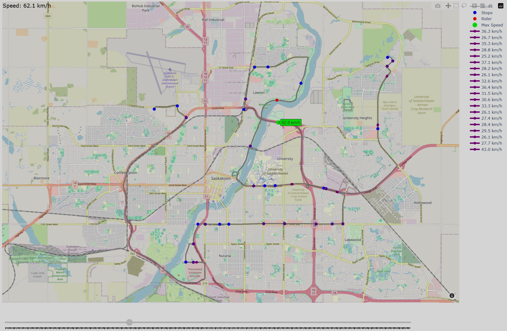

# Ride Telemetry Logger

## Introduction
This project logs and visualizes GPS ride telemetry data. It provides insights into speed, acceleration, stops, and other metrics for motorcycle or driving rides. Users can interactively scrub through the ride to see how speed and position change over time. 

This is a MVP for this project, the focus was more about figuring how to process the data accurately. I am planning to create a polished version in the future.

## Description
- Interpolates GPS route data for smooth visualization.
- Calculates velocity, acceleration, and longitudinal G-forces.
- Detects stops and highlights maximum speeds.
- Displays interactive route maps using Plotly with a slider for scrubbing.
- Includes tools for smoothing and cleaning outlier velocity data.
- Designed to handle highway rides and other scenarios with realistic GPS data.

## Features
- **Interactive route map:** Shows route, rider, stops, accelerations, and max speed.
- **Velocity smoothing:** Removes spikes and unrealistic jumps.
- **Acceleration detection:** Extracts rapid acceleration data, displaying the start and end speed, the duration, and an estimation of the G Forces experienced.
- **Custom slider:** Allows moving the rider along the route and updating speed display.

## Pictures

### 1. Application Overview
Displays the main interface of the Ride Telemetry Logger, showing the route, stops, and rider marker.

### 2. Acceleration Data
Hovering over the purple acceleration traces shows detailed information including start/end speeds, duration, and longitudinal G-force.

### 3. Top Speed Highlight
The lime marker indicates the maximum speed reached during the ride.

## Installation

1. Clone the repository:
git clone https://github.com/yourusername/ride-telemetry-logger.git
cd ride-telemetry-logger

2. Install required packages:
pip install -r requirements.txt

## Usage

1. Make sure your GPX or ride data file is in the ./data folder in the project.
   
2. Change the file path to point to your .gpx file.
   
3. Run the main script:
python src/main.py

4. The application will display the route, stops, rider marker, and accelerations. Use the slider to scrub through the ride and see the current speed.
